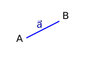
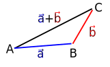
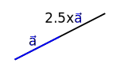
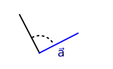
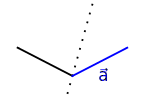
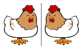
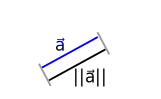

# Vectors

## Vector

A vector is often described as a quantity that has magnitude and direction.
They describe how to get from one point of space to another.

We will denote vectors as with an arrow, for example $\vec{a}$.
Sometimes people use other notations such as bold face $\mathbf{a}$ or just plain italics $a$.

## Where are they used?

- Vectors play in important role in geometry and physics.

- Vectors can represent **points** in two or three  (or more!) dimensions.

- Vectors can represent many **physical quantities** such as velocity, acceleration, forces, momentum, torques, ....

- Vectors can represent different aspects of a **dataset** together: for example, height and weight, or in analysis such as [text vectorisation](https://towardsdatascience.com/why-data-is-represented-as-a-vector-in-data-science-problems-a195e0b17e99).

- Vectors can represent **features** in machine learning: so called [feature vectors](https://brilliant.org/wiki/feature-vector/).

## Column vectors

A **column vector** is an ordered column of numbers
$$
 \vec{a} = \begin{pmatrix} a_1 \\ \vdots \\ a_n \end{pmatrix}.
$$
For example,
$$
 \vec{a} = \begin{pmatrix} 1 \\ 9 \\ 7 \end{pmatrix},
 \vec{b} = \begin{pmatrix} 2 \\ 11 \end{pmatrix},
 \vec{c} = \begin{pmatrix} -3 \end{pmatrix}.
$$

## Row vectors

A **row vector** is an ordered row of numbers:
$$
 \vec{a} = \begin{pmatrix} a_1 & \cdots & a_n \end{pmatrix}.
$$
For example,
$$
 \vec{a} = \begin{pmatrix} 4 & 5 & 2 \end{pmatrix},
 \vec{b} = \begin{pmatrix} 7 & 6 & 8 & 1 \end{pmatrix},
 \vec{c} = \begin{pmatrix} 9 \end{pmatrix}.
$$

## Vector addition

Vectors have the *functional* property that you can add them together to form a new vector.

::: {.container}
::::: {.col}
**Example**

Let $\vec{a} = \begin{pmatrix} 4 \\ 5 \\ 2 \end{pmatrix}$ and $\vec{b} = \begin{pmatrix} 1 \\ 9 \\ 7 \end{pmatrix}$. Then
$$
 \vec{a} + \vec{b} = \begin{pmatrix} 4 + 1 \\ 5 + 9 \\ 2 + 7 \end{pmatrix} = \begin{pmatrix} 5 \\ 14 \\ 9 \end{pmatrix}.
$$
:::::
::::: {.col}

:::::
:::

## Scalar multiplication

Vectors have the *functional* property that you can multiply by a number to form a new vector.

::: {.container}
:::: {.col}
**Example**

Let $\vec{a} = \begin{pmatrix} 4 \\ 5 \\ 2 \end{pmatrix}$.
Then
$$
 2.5 \vec{a} = \begin{pmatrix} 2.5 \times 4 \\ 2.5 \times 5 \\ 2.5 \times 2 \end{pmatrix} = \begin{pmatrix} 10 \\ 12.5 \\ 5 \end{pmatrix}.
$$
:::::
::::: {.col}

:::::
:::

# Linear transformation

## Definition

Linear transformation a functions that take one vector and give back another such that addition and scalar multiplication is preserved.

These are functions that take straight lines to straight lines.

Call the function $T$ then:
$$
\begin{aligned}
  T ( \vec{a} + \vec{b} ) & = T (\vec{a}) + T(\vec{b}) && \mbox{ for all vectors } \vec{a}, \vec{b} \\
  T ( s \vec{a} ) & = s T (\vec{a}) && \mbox{ for all vectors } \vec{a}, \mbox{ and numbers } s.
\end{aligned}
$$

## Example 1: Scaling

For any number $s$, scaling by $s$ means changing the length of the vector by $s$ to make it bigger or smaller.

::: {.container}
::::: {.col}

:::::
::::: {.col}

:::::
:::

## Example 2: Rotation

In 2D, for any angle $\theta$, rotating by $\theta$ means moving vectors about a centre point.

::: {.container}
::::: {.col}

:::::
::::: {.col}

:::::
:::

## Example 3: Reflection

Reflection creates a mirror image of a vector.

::: {.container}
::::: {.col}

:::::
::::: {.col}

:::::
:::

# Other vector operations

## Transpose

We use the notation $\vec{a}^T$ to represent the **transpose** of a vector.

For a row vector, its transpose is a column vector (with the same entries) and for a column vector, its transpose is a row vector (with the same entries).

**Example**

Let $\vec{a} = \begin{pmatrix} 4 \\ 5 \\ 2 \end{pmatrix}$.
Then
$$
 \vec{a}^T = \begin{pmatrix} 4 & 5 & 2 \end{pmatrix}.
$$

*We will see this concept again in the next lecture*.

## Norm

The **norm** of a vector represents its **length**. We denote it by $\| \vec{a} \|$

For a general vector $\vec{a} = \begin{pmatrix} a_1 & a_2 & \cdots a_n \end{pmatrix}$, the norm of $\vec{a}$ is:
$$
 \| \vec{a} \|
 = \sqrt{a_1^2 + a_2^2 + \cdots + a_n^2}
 = \sqrt{\sum_{i=1}^n a_i^2}.
$$

::: {.container}
::::: {.col}
**Example**

Let $\vec{a} = \begin{pmatrix} 4 & 5 & 2 \end{pmatrix}$.
Then
$$
 \| \vec{a} \| = \sqrt{4^2 + 5^2 + 2^2} = \sqrt{16 + 25 + 4} = \sqrt{45}.
$$
:::::
::::: {.col}

:::::
:::

## Inner product

The *inner product* of vectors $\vec{a}$ and $\vec{b}$ tells us how much of $\vec{a}$ is in the direction $\vec{b}$. We denote the inner product as $\vec{a} \cdot \vec{b}$.

For generate vectors $\vec{a} = \begin{pmatrix} a_1 & a_2 & \cdots a_n \end{pmatrix}$ and $\vec{b} = \begin{pmatrix} b_1 & b_2 & \cdots & b_n \end{pmatrix}$, we have
$$
 \vec{a} \cdot \vec{b} = a_1 b_1 + a_2 b_2 + \cdots a_n b_n = \sum_{i=1}^n a_i b_i.
$$

**Example**

Let $\vec{a} = \begin{pmatrix} 4 & 5 & 2 \end{pmatrix}$.
Then
$$
 \| \vec{a} \| = \sqrt{4^2 + 5^2 + 2^2} = \sqrt{16 + 25 + 4} = \sqrt{45}.
$$

## Special case

*What is the inner product of a vector $\vec{a}$ with itself?*

$$
\begin{aligned}
 \vec{a} \cdot \vec{a}
 & = a_1 a_1 + a_2 a_2 + \cdots + a_n a_n \\
 & = a_1^2 + \cdots a_n^2 \\
 & = \sum_{i=1}^n a_i^2 \\
 & = \| \vec{a} \|^2.
\end{aligned}
$$

# Summary

- We can use vectors to represent objects in geometry, physics and data science.

- We can write vectors as column or row vectors.

- Linear transforms provide a way to *transform* vectors.

- Many linear transformations correspond to a geometric transformation.
