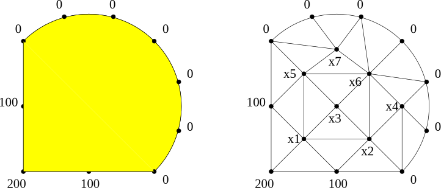
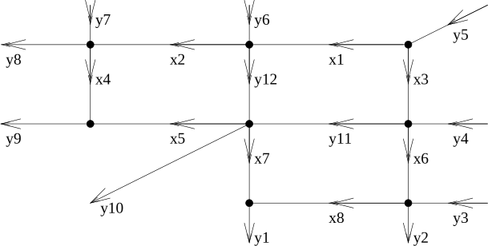

# Introduction

**Basic problem**:\
Solve a set of $n$ **linear** equations for $n$ unknown values $x_j$, $j = 1, \ldots, n$.

**Notation**:\
Equation 1: $a_{11} x_1 + a_{12} x_2 + a_{13} x_3 + \cdots + a_{1n} x_n = b_1$\
Equation 2: $a_{21} x_2 + a_{22} x_2 + a_{23} x_3 + \cdots + a_{2n} x_n = b_2$\
$\vdots$\
Equation $i$: $a_{i1} x_1 + x_{i2} x_2 + a_{i3} x_3 + \cdots + a_{in} x_n = b_i$\
$\vdots$\
Equation $n$: $a_{n1} x_1 + a_{n2} x_2 + a_{n3} x_3 + \cdots + a_{nn} x_n = b_n$.

## Notes

- The values $a_{ij}$ are known as **coefficients**.

- The **right hand side** values $b_i$ are known.

- $x_1, x_2, x_3, \ldots, x_n$ are **not** known.

Computing $x_1, x_2, x_3, \ldots, x_n$ solves the problem.

## Notes

- Many computational algorithms require the solution of linear equations, e.g. in fields such as
  - Scientific computation;
  - Network design and optimisation;
  - Graphics and visualisation.
  - See [here](http://aix1.uottawa.ca/~jkhoury/system.html) for examples.
  
- Typically these systems are *very* large ($n \approx 10^9$).

- It is therefore important that this problem can be solved
	- accurately;
	- efficiently;
	- reliably.
	
## General matrix-vector form

Solve the system of equations given by
$$
 \begin{pmatrix}
 a_{11} & a_{12} & a_{13} & \cdots & a_{1n} \\
 a_{21} & a_{22} & a_{23} & \cdots & a_{2n} \\
 a_{31} & a_{32} & a_{33} & \cdots & a_{3n} \\
 \vdots & \vdots & \vdots & & \vdots \\
 a_{n1} & a_{n2} & a_{n3} & \cdots & a_{nn}
 \end{pmatrix}
 \begin{pmatrix}
 x_1 \\ x_2 \\ x_3 \\ \vdots \\ x_n
 \end{pmatrix} =
 \begin{pmatrix}
 b_1 \\ b_2 \\ b_3 \\ \vdots \\ b_n
 \end{pmatrix}.
$$

In other words, given an $n \times n$ matrix $A$ and an $n$-vector $\vec{b}$, find the $n$-vector $\vec{x}$ which satisfies $A \vec{x} = \vec{b}$.

## Application I: Temperature in a sealed room

Suppose we wish to estimate the temperature distribution inside an object:

We can place a network of points inside the object and use the following model: the temperature at each interior point is the average of its neighbours.

## Application I (cont.)

This example leads to the system:
$$
\begin{pmatrix}
  1   & -1/6 & -1/6 &  0   & -1/6 &  0   & 0 \\
 -1/6 &  1   & -1/6 & -1/6 &  0   & -1/6 & 0 \\
 -1/4 & -1/4 &  1   &  0   & -1/4 & -1/4 & 0 \\
  0   & -1/5 &  0   &  1   &  0   & -1/5 & 0 \\
 -1/6 &  0   & -1/6 &  0   &  1   & -1/6 & -1/6 \\
  0   & -1/8 & -1/8 & -1/8 & -1/8 & 1 & -1/8 \\
  0   &  0   &  0   &  0   & -1/5 & -1/5 &   1
\end{pmatrix}
\begin{pmatrix}
 x_1 \\ x_2 \\ x_3 \\ x_4 \\ x_5 \\ x_6 \\ x_7
\end{pmatrix} =
\begin{pmatrix}
400/6 \\ 100/6 \\ 0 \\ 0 \\ 100/6 \\ 0 \\ 0
\end{pmatrix}.
$$

## Application II: Traffic network

Suppose we wish to monitor the flow of traffic in a city centre:

As the above example shows, it is not necessary to monitor at every single road. 
If we know all of the $y$ values we can calculate the $x$ values!

## Application II (cont.)

This example leads to the system:
$$
\begin{pmatrix}
1 & 0 & 1 & 0 & 0 & 0 & 0 & 0 \\
1 & -1 & 0 & 0 & 0 & 0 & 0 & 0 \\
0 & 1 & 0 & -1 & 0 & 0 & 0 & 0 \\
0 & 0 & 1 & 0 & 0 & -1 & 0 & 0 \\
0 & 0 & 0 & 0 & 1 & 0 & 1 & 0 \\
0 & 0 & 0 & 1 & 1 & 0 & 0 & 0 \\
0 & 0 & 0 & 0 & 0 & 1 & 0 & -1 \\
0 & 0 & 0 & 0 & 0 & 0 & 1 & 1
\end{pmatrix}
\begin{pmatrix}
x_1 \\ x_2 \\ x_3 \\ x_4 \\ x_5 \\ x_6 \\ x_7 \\ x_8
\end{pmatrix} =
\begin{pmatrix}
y_5 \\ y_{12} - y_6 \\ y_8 - y_7 \\ y_{11} - y_4 \\
y_{11} + y_{12} - y_{10} \\ y_9 \\ y_2 - y_3 \\ y_1
\end{pmatrix}.
$$

# Special types of matrices

The general matrix $A$ on the slide before the examples is known as a **full** matrix: any of its components $a_{ij}$ might be nonzero.

Often the problem being solved leads to a matrix with a particular structure.

- Some entries may be known to be zero.
- If this is the case then it is often possible to use this knowledge to improve the efficiency of the algorithm (in terms of both speed and/or storage).

## Examples 1

One common (and important) structure takes the form
$$
 \begin{pmatrix}
 a_{11} & 0 & 0 & \cdots & 0 \\
 a_{21} & a_{22} & 0 & \cdots & 0 \\
 a_{31} & a_{32} & a_{33} & \cdots & 0 \\
 \vdots & \vdots & \vdots & \ddots & \vdots \\
 a_{n1} & a_{n2} & a_{n3} & \cdots & a_{nn}
 \end{pmatrix}
 \begin{pmatrix}
 x_1 \\ x_2 \\ x_3 \\ \vdots \\ x_n
 \end{pmatrix} =
 \begin{pmatrix}
 b_1 \\ b_2 \\ b_3 \\ \vdots \\ b_n
 \end{pmatrix}.
$$

- A is a **lower triangular** matrix.
  Every entry above the leading diagonal is zero:
  $$
  a_{ij} = 0 \quad \mbox{ for } \quad j > i.
  $$

- The *transpose* of this matrix is an **upper triangular** matrix and can be treated in a very similar manner.

## Examples 2

**Sparse matrices** are extremely common in any application which relies on some form of *graph* structure. <!-- (see both temperature and traffic network examples) -->

- The $a_{ij}$ typically represents some form of "communication" between vertices $i$ and $j$ of the graph, so the element is only nonzero if the vertices are connected.

- There is no generic pattern for these entries, though there is usually one that is specific to the problem solved.

<!-- - Usually $a_{ii} \neq 0$ - the diagonal is nonzero. -->

- A "large" portion of the matrix is zero.
  - A full $n \times n$ matrix has $n^2$ nonzero entries.
  - A sparse $n \times n$ has $\alpha n$ nonzero entries, where $\alpha \ll n$.

- Many special techniques exist for handling sparse matrices, some of which can be used automatically within Python ([scipy documentation](https://docs.scipy.org/doc/scipy/reference/sparse.html))

## Significance

What is the significance of these special examples?

- In the next lecture we will discuss a general numerical algorithm for the solution of linear systems of equations.

- This will involve **reducing** the problem to one involving a **triangular matrix** which, as we show below, is relatively easy to solve.

- In subsequent lectures, we will see that, for *sparse* matrix systems, alternative solution techniques are available.

# Uniqueness of solutions

For the time-being we will only consider *square* systems of equations:\
for which the number of equations is equal to the number of unknowns ($n$, say).

In this case the following statements are *equivalent*:

- The linear system $A \vec{x} = \vec{b}$ has a **unique solution**.
- There exists a matrix (let's call it $A^{-1}$) such that $A^{-1} A = I$, and we say that the matrix $A$ is **invertible**.
- The linear system $A \vec{x} = \vec{b}$ is **non-singular**. <!-- TODO what does this mean? -->

# Solving triangular systems

A general *lower triangular* system of equations has $a_{ij} = 0$ for $j > 1$ and takes the form:
$$
 \begin{pmatrix}
 a_{11} & 0 & 0 & \cdots & 0 \\
 a_{21} & a_{22} & 0 & \cdots & 0 \\
 a_{31} & a_{32} & a_{33} & \cdots & 0 \\
 \vdots & \vdots & \vdots & \ddots & \vdots \\
a_{n1} & a_{n2} & a_{n3} & \cdots & a_{nn}
 \end{pmatrix}
 \begin{pmatrix}
 x_1 \\ x_2 \\ x_3 \\ \vdots \\ x_n
 \end{pmatrix} =
 \begin{pmatrix}
 b_1 \\ b_2 \\ b_3 \\ \vdots \\ b_n
 \end{pmatrix}.
$$

Note the first equation is
$$
a_{11} x_1 = b_1.
$$

## Solving triangular systems (cont).

The $x_i$ can be found by calculating
$$
x_i = \frac{1}{a_{ii}} \left(b_i - \sum_{j=1}^{i-1} a_{ij} x_j \right)
$$
for each row $i = 1, 2, \ldots, n$ in turn.

- Each calculation requires only previously computed values $x_j$ (and the sum gives a loop for $j < i$ - see `lower_triangular_solve` in the file [`matrixSolve_lec5_lec6.py`](../code_swjtu/lec05/matrixSolve_lec5_lec6.html)).
- The matrix $A$ **must** have nonzero diagonal entries\
  i.e. $a_{ii} \neq 0$ for $i = 1, 2, \ldots, n$.
- **Upper triangular** systems of equations can be solved in a similar manner (see `upper_triangular_solve` in the same file).
- Worked examples in [`lec5_triangularSolve.py`](../code_swjtu/lec05/lec5_triangularSolve.html).

## Examples 1

Solve the lower triangular system of equations given by
$$
\begin{aligned}
 2 x_1 && && &= 2 \\
 x_1 &+& 2 x_2 && &= 7 \\
 2 x_1 &+& 4 x_2 &+& 6 x_3 &= 26
\end{aligned}
$$
or, equivalently,
$$
\begin{pmatrix}
2 & 0 & 0 \\
1 & 2 & 0 \\
2 & 4 & 6
\end{pmatrix}
\begin{pmatrix}
x_1 \\ x_2 \\ x_3
\end{pmatrix} =
\begin{pmatrix}
2 \\ 7 \\ 26
\end{pmatrix}.
$$

## Examples 1: solution

The solution can be calculated systematically from
$$
\begin{aligned}
x_1 &= \frac{b_1}{a_{11}} = \frac{2}{2} = 1 \\
x_2 &= \frac{b_2 - a_{21} x_1}{a_{22}} 
= \frac{7 - 1 \times 1}{2} = \frac{6}{2} = 3 \\
x_3 &= \frac{b_3 - a_{31} x_1 - a_{32} x_2}{a_33} 
= \frac{26 - 2 \times 1 - 4 \times 3}{6}  = \frac{12}{6}
= 2
\end{aligned}
$$
which gives the solution $\vec{x} = (1, 3, 2)^T$.

## Examples 2

Solve the upper triangular linear system given by
$$
\begin{aligned}
2 x_1 &+& x_2 &+& 4 x_3 &=& 12 \\
&& 1.5 x_2 && &=& 3 \\
&& && 2 x_3 &=& 4
\end{aligned}.
$$

## Notes

- It is simple to solve a lower (upper) triangular system of equations (provided the diagonal is nonzero).

- This process is often referred to as **forward** (**backward**) **substitution**.

- A general system of equations (i.e. a full matrix $A$) can be solved rapidly once it has been reduced to upper triangular form.

- This will be the topic of the next lecture...

