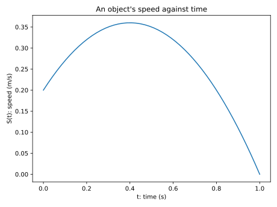
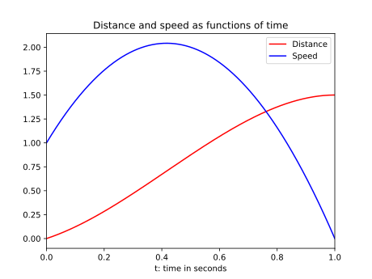
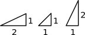
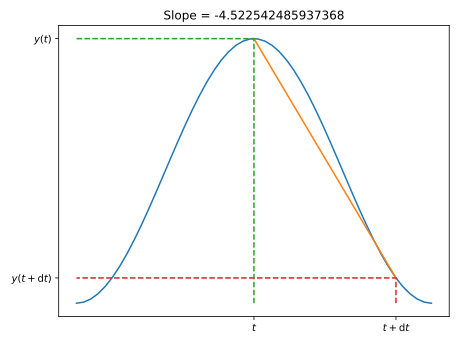
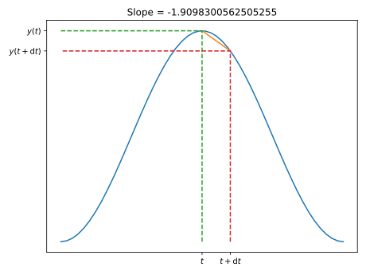

# Lecture 11: Dynamic models and rates of change

## Static versus dynamic problems

-   So far we have considered computational models of problems that are assumed to be static, for example:

    -   calculating the [distribution of temperature inside an object](lec05.html#/application-i-temperature-in-a-sealed-room) for a given, fixed, temperature distribution around the boundary;

    -   finding the [flow of traffic in a network](lec05.html#/application-ii-traffic-network) given a fixed set of observations;

    -   the sparse matrix representation of the WWW, at a given instant in time, that is used by [Google's PageRank algorithm](https://en.wikipedia.org/wiki/PageRank#Algorithm).

-   Linear systems of equations model problems for which there are constant parameters and a fixed answer.

-   Many other problems that require computational models are dynamic - they change with time - for example:

    -   tracking the position and speed of an object in a video game;

    -   predicting the evolution of a weather system over the next 48 hours;

    -   modelling a population (bacteria, animals, people, etc.) as it evolves in time;

    -   atmospheric chemistry models for the dispersion of emissions, pollutants, ozone, etc.

## Rates of change

### Example: Tracking an object

-   Suppose we know that an object is moving at 2 meters per second (m/s) - what does that mean?

    -   Easy: in one second it will travel 2 meters!

-   So, how far will it travel in:

    -   $0.1$ seconds?
    -   $0.01$ seconds?
    -   $0.001$ seconds?
    -   $10^{-6}$ seconds?

-   What does this tell us about speed?

    -   $\text{Distance travelled} = \text{speed} \times \text{time}$
    -   That is, $\text{speed} = \dfrac{\text{distance travelled}}{\text{time}}$
    -   Equivalently, $\text{speed} = \dfrac{(\text{distance at end}) - (\text{distance at start})}{\text{time}}$.

-   Another way of saying this is that the speed is the **rate of change** of distance:

    -   2 meters per second;
    -   0.002 meters per millisecond;
    -   0.000002 meters per microsecond;
    -   etc.

## The derivative as a rate of change

-   Now suppose the object's speed is not constant.

-   For example, the speed $S(t)$ could be given at each time $t$ by

    

-   How far would the object travel in one second now?

### Tracking at a non-constant speed

This is a much harder problem.

**How can we approximate the solution?**

1.  We could consider each tenth of a second separately and estimate the distance covered at each tenth (assuming the $s$ is approximately constant in each interval):

    ``` python
    D, t = 0.0, 0.0
    for i in range(10):
        D = D + 0.1 * S(t)
        t = t + 0.1
    ```

2.  We could consider each hundredth of a second separately and estimate the distance covered at each hundredth:

    ``` python
    D, t = 0.0, 0.0
    for i in range(100):
        D = D + 0.01 * S(t)
        t = t + 0.01
    ```

3.  We could consider each thousandth of a second separately and estimate the distance covered at each thousandth:

    ``` python
    D, t = 0.0, 0.0
    for i in range(1000):
        D = D + 0.001 * S(t)
        t = t + 0.001
    ```

We expect each of these approximations to get more and more accurate...

#### Example

Consider $S(t)$ given by:
```python
def s(t):
    """
    Return a value for the speed, s, as a function of time, t.
    ARGUMENTS:  t   the time
    RETURNS:    s   the speed
    """
    return 1 + 5 * t - 6 * t ** 2
```

-   The following table of results is obtained:

    | \# intervals   | increment size ($\mathrm{d}t$)   | total distance   |
    | -------------- | -------------------------------- | ---------------- |
    | 10             | 1.000e-01                        | 1.54000          |
    | 100            | 1.000e-02                        | 1.50490          |
    | 1000           | 1.000e-03                        | 1.50050          |
    | 10000          | 1.000e-04                        | 1.50005          |
    | 100000         | 1.000e-05                        | 1.50000          |

-   We appear to be converging to an answer in the limit as $\mathrm{d}t \to 0$...

### Why does this work?

-   The approach above uses the fact that, at any *instant* in time, the speed is the rate of change in distance:

    -   That is, $\text{speed} = \dfrac{\text{change in distance}}{\text{time}}$;

    -   so, $\text{change in distance} = \text{time} \times \text{speed}$;

    -   in code this can be expressed as:

	    ``` python
        d = d + dt * s(t)
        ```

-   We can re-arrange the last expression to get the average speed over the interval for $t$ to $t + \mathrm{d}t$:

    $$
    S(t) = \frac{D(t+\mathrm{d}t) - D(t)}{\mathrm{d}t}.
    $$


-   In fact, to obtain a converged answer it is necessary to take smaller and smaller choices for $\mathrm{d}t$.

-   In mathematical notation this is written as

    $$
    S(t) = \lim_{\mathrm{d}t \to 0} \frac{D(t+\mathrm{d}t) - D(t)}{\mathrm{d}t}.
    $$

-   This is what **rate of change** really means at each instant.

-   The standard terminology for this is to say that the speed $S(t)$ is the **derivative** of the distance $d$ with respect to time $t$.

-   The notation for this is $S(t) = D'(t)$.

### A graphical interpretation

-   We can give a graphical interpretation of the relationship between $D(t)$ and its derivative $D'(t)$.



Inspection of the plots shows that the **steepness** of the red curve $D(t)$ is related to the **value** of the blue curve $S(t)$:

-   As the blue curve increases in value, the red curve increases in steepness.

-   When the blue curve starts to decrease in value, the red curve decreases in steepness.

-   By the time the blue curve has a value of zero the red curve is flat.

In fact the **gradient** of the red curve is precisely equal to the **value** of the blue curve.

This provides for an alternative interpretation of the derivative of a function...

> The function $D'(t)$ is the function whose value is equal to the slope (or gradient) of $D(t)$ at every value of $t$.

## The derivative as a gradient

-   What is the slope/gradient of a line?

-   It is the steepness...

    

-   The equation of a straight line with slope $m$ is given by

    $$
    y(t) = m t + c.
    $$

### Slope of a curve

-   What is the slope/gradient of a curve?

    

-   The slope of the straight-line approximation ("chord") is

    $$
    \frac{y(t + \mathrm{d}t) - y(t)}{\mathrm{d}t}.
    $$

-   We can get a better approximation by taking a smaller value for $\mathrm{d}t$...

    

-   We can get an **even** better approximation by taking an **even** smaller value for $\mathrm{d}t$...

    


By taking smaller and smaller values of $\mathrm{d}t$, it becomes clear that we can assign an instantaneous value to the slope at any point $t$:

$$
\lim_{\mathrm{d}t \to 0} \frac{y(t+\mathrm{d}t) - y(t)}{\mathrm{d}t}.
$$

*But this is precisely the definition of derivative $y'(t)$!*

## Further reading

- Wikipedia: [Rate of change](https://en.wikipedia.org/wiki/Rate_(mathematics)#Of_change)
- Wikipedia: [Speed](https://en.wikipedia.org/wiki/Speed)
- Wikipedia: [Derivative](https://en.wikipedia.org/wiki/Derivative)
- Maths is fun: [Derivatives introduction](https://www.mathsisfun.com/calculus/derivatives-introduction.html)
