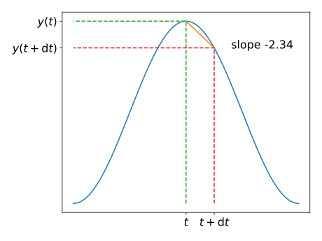
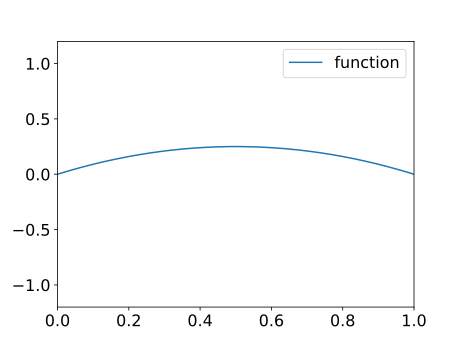
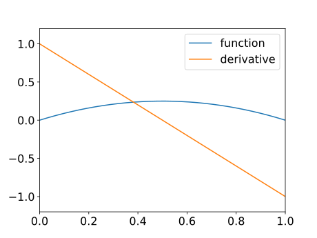
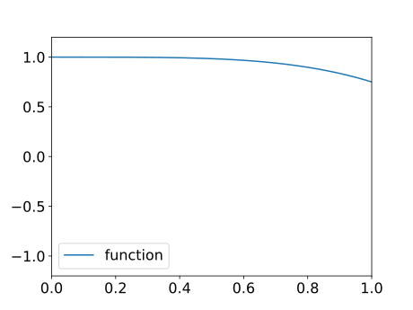
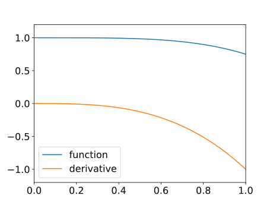
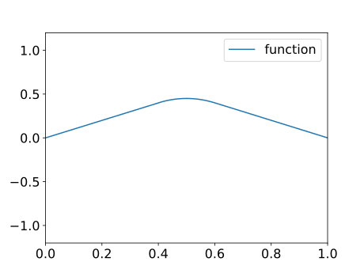
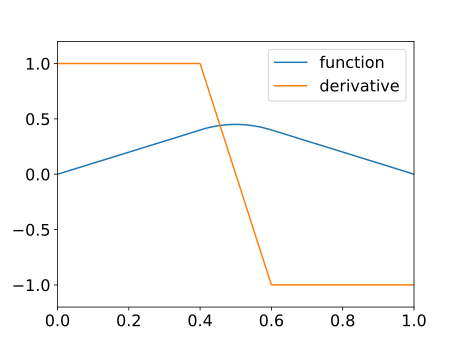
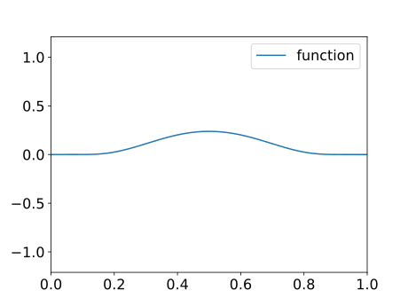
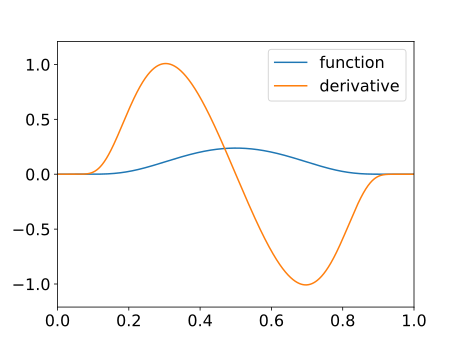
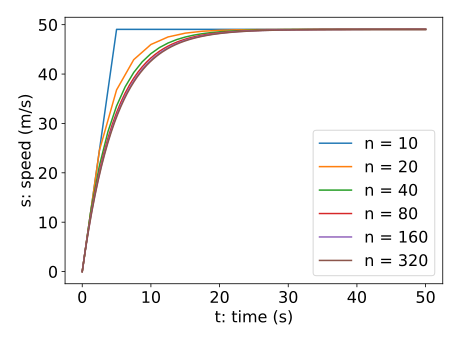

# Recap

-   We discussed the concept of **rate of change**

    -   speed is the rate of change of distance;

    -   instantaneous speed is the limit of average speeds over shorter and shorted time periods, $$
        \frac{D(t + \mathrm{d}t) - D(t)}{\mathrm{d}t} \mbox{ as } \mathrm{d}t \to 0;
        $$

    -   instantaneous rate of change as the limit of $$
        \frac{(\text{value at time } t + \mathrm{d}t) - (\text{value at time } t)}{\mathrm{d}t} \mbox{ as } \mathrm{d}t \to 0.
        $$

## Recap (cont.)

-   We defined the derivative of a function $y(t)$ by $$
    y'(t) = \lim_{\mathrm{d}t \to 0} \frac{y(t+\mathrm{d}t) - y(t)}{\mathrm{d}t}.
    $$

-   We saw that speed, $S(t)$, is the derivative of distance covered, $D(t)$: $$
    S(t) = D'(t) = \lim_{\mathrm{d}t \to 0}
    \frac{D(t+\mathrm{d}t) - D(t)}{\mathrm{d}t}.
    $$

## Recap (cont.)

-   We saw a geometric interpretation of the derivative of $y(t)$ by considering the slope of its graph:

    {width="75%"}

-   The slope of the straight line approximation (chord) is $$
    \frac{y(t + \mathrm{d}t) - y(t)}{\mathrm{d}t}.
    $$

# Graphs and derivatives

-   We now know a geometric interpretation of the derivative of a function, as being equal to the function's slope at each point.

-   This means we can sketch an approximation to the derivative of any given function.

-   In the following examples, the graph of a function $y(t)$ is given and the graph of $y'(t)$ is then approximated.

## Example 1

::: r-stack
::: fragment

:::

::: fragment

:::
:::

## Example 2

::: r-stack
::: fragment

:::

::: fragment

:::
:::

## Example 3

::: r-stack
::: fragment

:::

::: fragment

:::
:::

## Example 4

::: r-stack
::: fragment

:::

::: fragment

:::
:::

# Differential equations

-   We have already seen that, for speed, $S(t) = D'(t)$.

-   What is the rate of change of speed?

-   Answer: acceleration, $a(t)$ say:

    -   a positive value for $a(t)$ means that speed is increasing whilst a negative value means that speed is decreasing.

-   When a model takes the form of an equation which involves one or more derivatives then it is called a **differential equation**.

## Differential equations (cont.)

-   We have already seen (and computationally solved) a simple example of a differential equation: $$
    D'(t) = 1 + 5t - 6t^2
    $$ where $D(0) = 0$.

-   Most models of dynamic processes take the form of differential equations.

-   The following example uses the fact that the acceleration of an object is equal to the rate of change of its speed:

    -   i.e. $a(t) = S'(t)$.

## An object in free fall

-   Consider a simple model for an object falling from a large height, based on the two following assumptions:

    1.  all objects are attracted downward with an acceleration due to gravity of $9.81 \, \mathrm{m} / \mathrm{s}^2$;

    2.  air resistance causes an object to decelerate in proportion to its speed (i.e., the faster it travels the greater the air resistance).

-   *What is the net acceleration on the object?*

    -   If it is falling with speed $S(t)$ the net acceleration *downwards* is $g - kS(t)$ for some constant $k$.

-   This results in the following differential equation: $$
    S'(t) = g - k S(t).
    $$

## An object in free fall (cont.)

-   How could we solve this equation?

    -   Recall how we solved $D'(t) = 1 + 5t - 6t^2$?
    -   We can do a similar thing again: divide the time period into lots of small intervals and assume everything is approximately constant on each time interval.

-   We know that $$
    S'(t) = \lim_{\mathrm{d}t \to 0} \frac{S(t + \mathrm{d}t) - S(t)}{\mathrm{d}t}
    \approx \frac{S(t+ \mathrm{d}t) - S(t)}{\mathrm{d}t}
    $$ for a small value of $\mathrm{d}t$.

-   Hence we can say that: $$
    S(t + \mathrm{d}t) = S(t) + \mathrm{d}t (g - k S(t)).
    $$

## Python algorithm: [`freefall.py`](../code/lec12/freefall.html)

::: r-fit-text
``` python
def freefall(n):
    """
    Plot the trajectory of an object falling freely.
    Input: n number of timesteps
    """

    tfinal = 50.0  # Select the final time
    g = 9.81  # acceleration due to gravity (m/s)
    k = 0.2  # air resistance coefficient

    # initialise time and speed arrays array
    t = np.zeros([n + 1, 1])
    s = np.zeros([n + 1, 1])

    # set initial conditions
    s[0] = 0.0
    t[0] = 0.0

    dt = (tfinal - t[0]) / n  # calculate step size

    # take n time steps, in which it is assumed that the acceleration
    # is constant in each small time interval
    for i in range(n):
        t[i + 1] = t[i] + dt
        s[i + 1] = s[i] + dt * (g - k * s[i])

    # plot output
    plt.plot(t, s, label=f"n = {n}")
```
:::

## Python algorithm: Results

{.r-strech}

# Euler's method

-   The approach we have used applies for *any* differential equation involving just a single derivative.

-   It is called **Euler's method**.

-   We can always arrange such an equation in the form: $$
    y'(t) = f(t, y) \quad \mbox{ subject to the initial condition } y(t_0) = y_0.
    $$

-   Examples:

    1.  $y'(t) = 1+ 5t - 6t^2$ and $y(0) = 0$.
    2.  $y'(t) = g- ky$ and $y(0) =0$.
    3.  $y'(t) = -y^2 + \frac{1}{t}$ and $y(1) = 2$.

## Euler's method (cont.)

For the general equation we have the following algorithm:

``` python
def euler(rhs, t0, y0, tfinal, n):
    # Initialise the arrays ta and y
    t = np.zeros([n + 1, 1])
    y = np.zeros([n + 1, 1])
    t[0] = t0
    y[0] = y0

    # Calculate the size of each interval
    dt = (tfinal - t0) / float(n)
    # Take n steps of Euler's method
    for i in range(n):
        y[i + 1] = y[i] + dt * rhs(t[i], y[i])
        t[i + 1] = t[i] + dt

    return t, y
```

See the function [`euler`](../code/numericalSolve.html#euler) in [`numericalSolve.py`](../code/numericalSolve.py) and the script [`runEuler.py`](../code/lec12/runEuler.py).

## Example

-   Take three steps of Euler's method to approximate the solution of $$
    y'(t) = -y^2 + \frac{1}{t} \mbox{ subject to the initial condition } y(1) = 2
    $$ for $1 \le t \le 2$.

-   For this example we have:

    -   $n = 3$
    -   $t_0 = 1$
    -   $y_0 = 2$
    -   $t_{\text{final}} = 2$
    -   $\mathrm{d}t = (2-1)/3 = 1/3$
    -   $f(t, y) = -y^2 + 1/t$.

# Summary

-   Given the graph of $y(t)$ it is possible to sketch the graph of $y'(t)$ (with some care!).

-   Computational models which involve dynamic processes usually involve the use of derivatives.

-   An equation which includes a derivative is known as a **differential equation**.

-   To solve a differential equation it is necessary to know some information about the solution at some starting point (e.g. initial distance travelled, initial speed, population at a given point in time, etc.).

-   One computational approach to solve such equations is **Euler's method** - which gets more accurate with more sub-intervals used.
