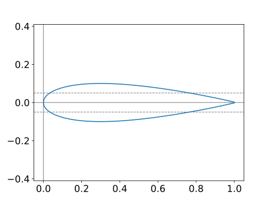
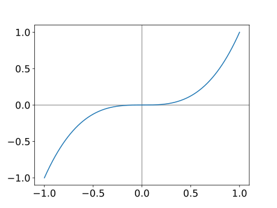
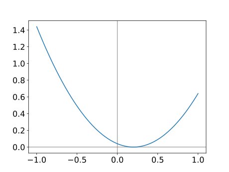
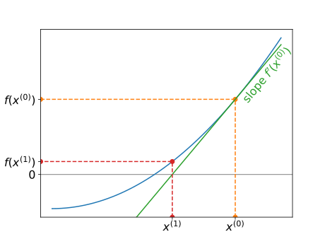

# The problem

| Given a continuous function $f(x)$, the problem is to find a point $x^*$ such that $f(x^*) = 0$. That is, $x^*$ is a solution of the equation $f(x) = 0$ and is called a **root of $f(x)$**.

**Examples**

1.  The linear equation $f(x) = a x + b = 0$ has a single solution at $x^* = -\frac{b}{a}$.

2.  The quadratic equation $f(x) = a x^2 + b x + c = 0$ is nonlinear , but simple enough to have a known formula for the solutions $$
    x^* = \frac{-b \pm \sqrt{b^2 - 4ac}}{2a}.
    $$

## The problem (cont.)

3.  A general nonlinear equation $f(x) = 0$ rarely has a formula like those above which can be used to calculate its roots.

It is also sometimes better to use a numerical method to solve an equation even if an exact formula exists:

-   the exact formula may have difficulties due to rounding errors;
-   the exact formula may be more expensive to compute.

## Example problems

The following three example problems will be used throughout this section to illustrate the properties of common methods for solving nonlinear equations.

1.  Calculate the value of $x = \sqrt{R}$, where $R$ is some positive real number, without the direct use of any `sqrt` function.

    -   Let $f(x) = x^2 - R$.
    -   The equations $f(x) = 0$ implies that $x^2 = R$, i.e. $x = \pm \sqrt{R}$.
    -   There are two solutions and the method should be able to distinguish between them.

## Example problems (cont.)

2.  The following formula allows the monthly repayments ($M$) on a compound interest mortgage (for a borrowing of $P$) to be calculated based upon an annual interest rate of $r$% and $n$ monthly payments ([more details](http://www.fonerbooks.com/interest.htm)).

    $$
    M = P \frac{\frac{r}{1200} \left(1 + \frac{r}{1200}\right)^n}{\left(1 + \frac{r}{12000}\right)^n - 1}.
    $$

    -   Suppose that we wish to work out how many monthly repayments of £1,000 would be required to repay a mortgage of $150,000$ at an annual rate of 5%.

    -   This would require us to solve $f(n) = 0$ where $f(n) = 1000 - 150000 \frac{\frac{5}{1200}(1+\frac{5}{1200})^n}{(1+\frac{5}{1200})^n - 1}$.

## Example problems (cont.)

3.  Consider the NACA0012 prototype wing section, which os often used for testing computational methods for simulating flows in aerodynamics:

```{=html}
<video width=50%>
```
```{=html}
<source src="../video/lec15/naca0012.webm" type="video/mp4">
```
```{=html}
</video>
```
`<small>`{=html}Video source: <https://youtu.be/wcahAqSFZ8k>`</small>`{=html}

## Example problem(cont.)

The profile is given by $$
y^{\pm}(x) = \pm(0.2969 \sqrt{x} - 0.126 x - 0.3516 x^2 + 0.2843 x^3 - 0.1015 x^4),
$$ in which $+$ gives the upper surface and $-$ gives the lower surface.

::: container
::: col
Find the point $x$ at which the thickness $t$ of the aerofoil is $0.1$, i.e. solve $f(x) = 0$ where $f(x) = y^+(x) - y^-(x) - 0.1$.

-   There will be two solutions for $x$ for this value of $t$.
:::

::: col

:::
:::

# Iterative methods

Use the concept of **iterative** (or **iterative improvement**) again.

-   Given an initial estimate of the root $x^{(0)}$, try to generate a better approximation $x^{(1)}$ to the root.

-   Once $x^{(1)}$ has been computed, it can be used to compute another estimate $x^{(2)}$ in the same way (and so on...).

-   Generally, $x^{(i)}$ is used to compute $x^{(i+1)}$ (though other previous estimates may be used as well).

-   There are **many** methods for doing this.

## Issues

-   Does the iteration converge?

-   That is, will $x^{(i+1)}$ be a better estimate than $x^{(i)}$?

-   How will we know if this is true or not?

-   If the iteration does converge then how quickly does this happen?

-   How should we decide when to stop the iterative procedure?

# Bisection method

The simplest method for solving $f(x) = 0$, finding $x^*$ such that $f(x^*) = 0$, is known as the **bisection method**.

::: container
::: col
-   Assume for now that two points $x_L$ and $x_R$ are known for which $$
    f(x_L) f(x_R) < 0
    $$ i.e., the function evaluations at these points are of opposite sign.

-   If $f$ is continuous then this implies that there must be at least one root $x^*$ in the interval $(x_L, x_R)$. There may be more than one root.
:::

::: col

:::
:::

## The algorithm

-   Consider the point $x_C = (x_L + x_R) / 2$ and find $f(x_C)$.

    -   If $f(x_C) = 0$, then $x^* = x_C$ and we can stop.
    -   If $f(x_L) f(x_C) < 0$, then $x^* \in (x_L, x_C)$.
    -   If $f(x_C) f(x_R) < 0$, then $x^* \in (x_C, x_R)$.

-   Replace the interval (also termed **bracket**) $(x_L, x_R)$ with the new interval containing $x^*$.

    -   Note that in one step the length of the interval containing $x^*$ has been halved.

-   Repeat this process until $x_R - x_L < TOL$, where $TOL$ is a user-supplied value, i.e. repeat until the bracket is sufficiently small.

# Convergence analysis

-   Assume that $k$ steps are taken from an initial bracket $(a, b)$.

-   At each step the bracketing interval is halved.

-   So, after $k$ steps the length of the interval will be $\dfrac{b-a}{2^k}$.

-   For large $b-a$ (a large initial bracket) or small $TOL$ (high accuracy required) $k$ will be large.

-   Note that once $x_R - x_L < TOL$, we can estimate $x^* = (x_L + x_R)/2$, in which case the absolute error will be at most $\frac{1}{2} TOL$.

## Example 1

Use the bisection method to calculate $\sqrt{2}$ with an error of less than $10^{-4}$.

-   Use $R = 2$, so $f(x) = x^2 - 2$, which gives $x^* = \sqrt{2}$.
-   Set the initial bracket to be $[a, b] = [0, 2]$ and the error tolerance to be $TOL = 10^{-4}$.

This is implemented in [`runBisection.py`](../code/lec15/runBisection.html) using [`bisection`](../code/nonlinearSolve.html#bisection) from [`nonlinearSolve.py`](../code/nonlinearSolve.html).

The function call

``` bash
$ python runBisection.py sqrt2 0 2 1.0e-4
```

gives the root as $x^* = 1.4142$ after 14 iterations.

## Example 1 (cont.)

Note that

-   choosing $[a, b] = [-2, 0]$ results in $x^* = -1.4142$;
-   if $[a, b]$ brackets *both* roots, $\pm \sqrt{R}$, then $f(x_L) f(x_R) > 0$ and the bisection method cannot start.

Which roots, if any will the following initial intervals converge to? $$
[0,1] \qquad
[2, 10] \qquad
[-10, 10] \qquad
[-10, -1].
$$

## Example 2

Use the bisection method to calculate the number of monthly repayments of £1,000 that are required to repay a mortgage of £150,000 at an annual rate of 5%.

It is clear that 1 monthly repayment ($n=1$) will not be sufficient, whilst we should try a very large value of $n$ to try to bracket the correct solution.

The function call

``` bash
$ python runBisection.py compound 1.0 1000.0 0.1
```

The code does indeed give an initial bracket, and then converges to a solution of $x^* = 235.9$ after 13 iterations.

## Example 2 (cont.)

Note that if we do not try a sufficiently large value for $n$ for the upper range of the bracketing interval the method will fail. For example,

    $ python runBisection.py compound 1.0 100.0 0.1
    Running bisection on nonlinear function: compound
    With parameters:  ['1.0', '100.0', '0.1']
    Warning! The input values do not provide a bracket
    solution: x = None, f = None

A warning that the initial values for $n$ do not bracket a solution.

## Example 3

3.  Use the bisection method to find the points at which the thickness of the NACA0012 aerofoil is 0.1 with an error of less than $10^{-4}$.

It can be seen that $0 \le x^* \le 1$ but there are two solutions in this interval, so try $[x_L, x_R] = [0.5, 1]$ as the initial bracket.

``` bash
$ python runBisection.py naca0012 0.5 1.0 1.0e-4
```

This gives the root as $x^* \approx 0.7652$ after 12 iterations.

Note that:

-   taking $[x_L, x_R] = [0, 0.5]$ gives the other root $x^* \approx 0.0339$;
-   taking $[x_L, x_R] = [0, 1]$ or $[x_L, x_R] = [0.1, 0.6]$ would fail to give an initial bracket.

## Weaknesses of the bisection algorithm

-   Bisection is a reliable method for finding solutions of $f(x) = 0$ provided an initial bracket can be found.

::: container
::: col
-   It is far from perfect however:

    -   finding an initial bracket is not always easy;
    -   it can take a very large number of iterations to obtain an accurate answer;
    -   it can never find solutions of $f(x) = 0$ for which $f$ does not change sign.
:::

::: col
For example:


:::
:::

# Newton's method

-   **Newton's method** (or the **Newton-Raphson iteration**) is an alternative algorithm for solving $f(x) = 0$.

-   On the positive side:

    -   it does not require an initial bracket - just an initial iterate;
    -   it converges much more quickly than bisection;
    -   it can solve problems where the solution is also a turning point (see previous example).

-   On the negative side:

    -   it is not guaranteed to converge (unlike bisection with a good initial bracket).

## Graphical derivation of Newton's method

::: container
::: col
$x^{(i+1)}$ is computed by projecting the *slope* at $x^{(i)}$, $f'(x^{(i)})$, on to the $x$-axis, giving $$
\begin{aligned}
f'(x^{(i)}) & = \frac{f(x^{(i)}) - 0}{x^{(i)} - x^{(i+1)}} \\
\Rightarrow
x^{(i+1)} & = x^{(i)} - \frac{f(x^{(i)})}{f'(x^{(i)})}.
\end{aligned}
$$
:::

::: col

:::
:::

## Notes

-   The formula $x^{(i+1)} = x^{(i)} - \frac{f(x^{(i)})}{f'(x^{(i)})}$ requires an initial guess at the solution: $x^{(0)}$.

-   In order to apply Newton's method we need to be able to compute an expression for the derivative of $f(x)$:

    -   this may not always be possible or easy;
    -   in the examples that follow we will make use of the formula: $$
        f(x) = x^n \Rightarrow f'(x) = n x^{n-1},
          $$ which is true for any $n \neq 0$.

-   There are variants of Newton's method that allow the derivative to be approximated: we will return to these later.

## Examples

Write out an expression for the Newton iteration for each of the following functions $f(x)$ and then carry out 2 iterations using the resulting iteration and the given initial value $x^{(0)}$.

1.  $f(x) = x^2 - 5$ with $x^{(0)} = 2$.

This gives $f'(x) = 2x$ so the iterative formula is $$
x^{(i+1)}
= x^{(i)} - \frac{(x^{(i)})^2 - 5}{2 x^{(i)}}
= \frac{(x^{(i)})^2 + 5}{2 x^{(i)}}.
$$

## Examples (cont.)

This gives $$
\begin{aligned}
x^{(1)}
& = \frac{2^2 + 5}{2 \times 2}
= \frac{9}{4} = 2.25 \\
x^{(2)}
& = \frac{(\frac{9}{4})^2 + 5}{2 \times \frac{9}{4}}
= \frac{161}{72} \approx 2.23611
\end{aligned}
$$

(Note $\sqrt{5} = 2.23607$)

## Examples (homework)

2.  $f(x) = x^3 - 2x - 5$ with $x^{(0)} = 2$.

3.  $f(x) = x^3 - 2$ with $x^{(0)} = 1$.

# Summary

-   Bisection approach is a simple and reliable algorithm for solving a nonlinear equation.

-   An appropriate initial bracket must be found - some searching may be required to locate one.

-   The analysis shows that the method is not very fast.

-   Newton's method is an alternative approach:

    -   it does not require an initial bracket - just an initial iterate;
    -   it converges much more quickly than bisection;
    -   it can solve problems where the solution is also a turning point;

-   We will discuss some drawbacks of Newton's method next time...
