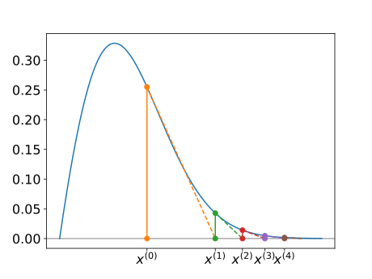
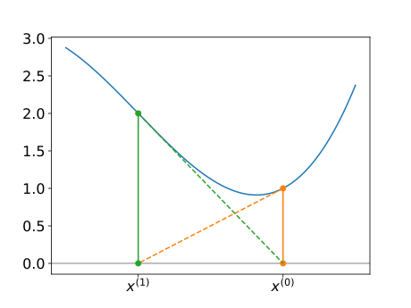

# Newton's method: Python implementation

-   A python implementation is provided in the function [`newton`](../code/numericalSolve.html#newton) in [`numericalSolve.py`](../code/numericalSolve.html).

-   This has four parameters:

    ``` python
    newton(fnon, dfnon, x0, tol)
    ```

    -   the first two are "function handles" for $f(x)$ and $f'(x)$ (`Callable[[float], float]`);
    -   the third and fourth are initial guess and convergence tolerance(`float` and `float`).

-   The main loop is as follows:

    ``` python
    x = x0
    fnon(x)
    while abs(f) > tol:       # iterate until less than or eq tol
        x = x - f / dfnon(x)  # apply one Newton iteration
        f = fnon(x)           # reevaluate f at new estimate
    ```

## Examples

1.  Use Newton's method to approximate the value of $\sqrt{2}$ by solving $x^2 - R = 0$.

    $$
     f(x) = x^2 - R
     \:
     \Rightarrow
     \:
     f'(x) = 2x
     \:
     \Rightarrow
     \:
     x^{(i+1)} = x^{(i)} - \frac{(x^{(i)})^2 - R}{2 x^{(i)}}.
     $$

    -   The call `$ python runNewton.py sqrt2 dsqrt2 1.0 1.0e-4` gives the root as $x^* \approx 1.414216$ after 3 iterations.
    -   The iteration stopped when $|f(x^{(i)})| < 10^{-4}$.
    -   We could also require that $|x^{(i+1)} - x^{(i)} < 10^{-4}$.

## Examples (cont).

2.  The call `$ python runNewton.py naca0012 dnaca0012 1.0 1.0e-4` gives the root as $x^* \approx 0.765789$ after 3 iterations for the NACA0012 aerofoil example.

3.  The call `$ python runNewton.py naca0012 dnaca0012 0.1 1.0e-4` gives the root as $x^* \approx 0.033863$ after 3 iterations for the second solution to the NACA0012 aerofoil example.

In all cases the performance is considerable superior to that of the bisection method.

# Zero derivative as a root

-   We saw that the bisection method cannot deal with the situation where a root occurs at a *turning point*. That is, $$
    f(x^*) = f'(x^*) = 0.
    $$

-   At first sight, it may appear that Newton's method will struggle with such situations since $x^{(i+1)} = x^{(i)} - \frac{f(x^{(i)})}{f'(x^{(i)})}$ would lead to $\frac{0}{0}$ occurring when $x^{(i)} = x^*$.

-   Fortunately, this is not a problem in practice and the iteration can still converge - although it converges more slowly than to a "simple root".

## Zero derivative as a root - example

Find a solution of $f(x) = 0$ using Newton's method when $$
f(x) = (x-1)^2 = x^2 - 2x + 1.
$$ This has a solution $x^* = 1$, however $f'(x) = 2x - 2$, so $f'(x^*) = 0$ when $x = x^*= 1$. The Newton iteration is given by $$
x^{(i+1)} = x^{(i)} - \frac{(x^{(i)} - 1)^2}{2 x^{(i)} - 2}
= x^{(i)} - \frac{1}{2}(x^{(i)} - 1)
= \frac{1}{2} (x^{(i)} + 1).
$$

The call `$ python runNewton.py lin dlin 4 1.0e-4` gives the root as $x^* \approx 1.0059$ after 9 iterations, confirming that we are able to obtain a solution.

Note that the convergence criterion is $|f(x)| < 10^{-4}$, which does not guarantee that $|x^* - x^{(i)}| < 10^{-4}$!

# Problems with Newton's method

When Newton's method works it is a fast way of solving a nonlinear equation $f(x) = 0$, but it does not always work.

1.  Consider applying a Newton iteration to the function $f(x) = x^3 + 2 x^2 + x + 1$ with $x^{(0)} = 0$.

    This gives $f'(x) = 3 x^2 + 4 x + 1$ so Newton's iteration is: $$
     x^{(i+1)} = x^{(i)} - \frac{(x^{(i)})^3 + 2 (x^{(i)})^2 + x^{(i)} + 1}{3 (x^{(i)})^2 + 4 x^{(i)} + 1}.
     $$

## Problems with Newton's method (cont.)

With $x^{(0)} = 0$ this gives $$
\begin{aligned}
 x^{(1)}
 & = 0 - \frac{0^3 + 2 \times 0^2 + 0 + 1}{3 \times 0^2 + 4 \times 0 + 1}
 = 0 - \frac{1}{1} = -1 \\
 x^{(2)}
 & = -1 - \frac{(-1)^3 + 2 \times (-1)^2 + -1 + 1}{3 \times (-1)^2 + 4 \times -1 + 1}
 = -1 - \frac{1}{0} = \mbox{``\texttt{inf}''}.
 \end{aligned}
$$

## Problems with Newton's method (cont.)

2.  We can also get cases where the iteration does not "blow up" but diverges slowly...



## Problems with Newtons' method (cont.)

3.  It is even possible for the iteration to simply cycle between two values repeatedly...



# Summary

-   Newton's method yields a relatively simple iteration for solving $f(x) = 0$.

-   When the algorithm converges it **usually** does so very quickly.

-   There are a number of cases for which the method breaks down - a number of initial guesses maybe required:

    -   the initial iterate must be "sufficiently close" to a root;
    -   a good initial guess may sometimes be obtained from the bisection method.

-   Newton's method assumes that the derivative of the function $f(x)$ is known and easily evaluated.
